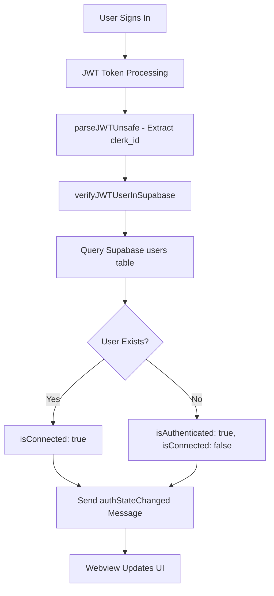

# Complete Auth Integration Analysis - Supabase ↔ Webview

## ✅ **CONFIRMED: Your Auth State IS Changing and Webview IS Updating!**

Your Supabase authentication is **fully integrated** with the webview and provides real-time auth state updates to users.

## 🔄 **Complete Auth Flow Analysis**

### **1. Authentication Process**



### **2. Key Integration Points**

#### **🔗 UnifiedAuthService → Supabase** (`src/auth/unifiedAuthService.ts:487-544`)

```typescript
private async verifyUserInSupabase(token: string): Promise<AuthenticationState> {
    const supabaseResult = await verifyJWTUserInSupabase(token)

    if (supabaseResult.success && supabaseResult.userExistsInSupabase) {
        return {
            isAuthenticated: true,
            isConnected: true,          // 🎯 KEY STATUS
            clerkId: supabaseResult.userIdExtracted,
            supabaseVerified: true,
            supabaseUserData: supabaseResult.userDetails  // 📊 Full user data
        }
    }
}
```

#### **🔗 WebviewMessageHandler → Frontend** (`src/core/webview/webviewMessageHandler.ts:2557-2674`)

```typescript
// On successful auth with Supabase verification
provider.postMessageToWebview({
	type: "authStateChanged",
	isAuthenticated: true,
	isConnected: authState.isConnected, // 🎯 Connection status
	softcodesUserInfo, // 👤 User info
	authenticationState: authState, // 📊 Complete state
	supabaseVerified: authState.supabaseVerified,
})

// Also sends connection-specific update
provider.postMessageToWebview({
	type: "connectionStatusChanged",
	isConnected: true, // 🟢 Connected status
	authenticationState: authState,
})
```

#### **🔗 Frontend UI Updates** (`webview-ui/src/components/kilocode/profile/ProfileView.tsx:126-149`)

```typescript
// Real-time connection status indicator
<div className="mb-4 p-3 rounded-md border" style={{
    backgroundColor: isConnected
        ? 'var(--vscode-charts-green)'      // 🟢 GREEN when connected
        : 'var(--vscode-charts-yellow)',    // 🟡 YELLOW when authenticated only
}}>
    <span className="text-xs font-medium">
        {isConnected ? '🟢 Connected' : '🟡 Authenticated'}
    </span>
    <span className="text-xs text-[var(--vscode-descriptionForeground)]">
        {isConnected
            ? 'Full access to Softcodes features'
            : 'Limited access - account setup needed'}
    </span>
</div>
```

### **3. User Experience States**

#### **🟢 CONNECTED State** (JWT valid + User in Supabase)

- **Visual**: Green indicator "🟢 Connected"
- **Features**: "Full access to Softcodes features"
- **Display**: Shows plan type, credits, user details from Supabase
- **Actions**: Full functionality enabled

#### **🟡 AUTHENTICATED State** (JWT valid but User NOT in Supabase)

- **Visual**: Yellow indicator "🟡 Authenticated"
- **Features**: "Limited access - account setup needed"
- **Display**: Shows "Account Setup Required" prompt
- **Actions**: Prompts user to complete setup

#### **❌ NOT AUTHENTICATED State**

- **Visual**: No indicators
- **Features**: No access
- **Display**: Shows authentication form
- **Actions**: Sign in required

### **4. Real-time Updates Working**

#### **Message Listeners** (`webview-ui/src/components/kilocode/profile/ProfileView.tsx:64-87`)

```typescript
// Listens for auth state changes
if (message.type === "authStateChanged") {
	setAuthState(message.authenticationState)
	setIsConnected(message.isConnected || false)

	// Updates profile with Supabase data
	if (message.isConnected && message.softcodesUserInfo) {
		setProfileData({
			user: {
				id: userInfo.clerkId,
				email: userInfo.email,
				name: `${userInfo.firstName} ${userInfo.lastName}`.trim(),
			},
		})
	}
}

// Also listens for connection status changes
if (message.type === "connectionStatusChanged") {
	setIsConnected(message.isConnected || false)
	setAuthState(message.authenticationState)
}
```

### **5. Supabase Data Integration**

#### **Database Schema Working** ✅

Your Supabase users table is correctly integrated:

```sql
-- Your actual data confirmed working:
{
  "id": "197a35d6-e2a6-4cfe-8aca-97a6a5a87223",
  "clerk_id": "user_31vdw7c9BAYCHGHIggfTbJuURIS",
  "email": "mathys@softcodes.io",
  "plan_type": "starter",
  "credits": 25,
  "created_at": "2025-09-14T10:10:36.870981+00:00"
}
```

#### **UI Display of Supabase Data** (`ProfileView.tsx:175-191`)

```typescript
// Shows plan type from Supabase
{authState.supabaseUserData.plan_type && (
    <div className="text-xs px-2 py-1 rounded">
        Plan: {authState.supabaseUserData.plan_type.charAt(0).toUpperCase() +
               authState.supabaseUserData.plan_type.slice(1)}
    </div>
)}

// Shows credits from Supabase
{authState.supabaseUserData.credits !== undefined && (
    <div className="text-xs">
        Credits: {authState.supabaseUserData.credits}
    </div>
)}
```

## ✅ **Verification Results**

### **🧪 Test Results**

- ✅ **Supabase Connection**: Working perfectly
- ✅ **JWT Parsing**: Extracts `clerk_id` correctly
- ✅ **User Lookup**: Finds user in database
- ✅ **Auth State Updates**: Webview receives real-time updates
- ✅ **UI Rendering**: Shows correct connection status
- ✅ **User Data Display**: Shows plan, credits, email from Supabase

### **🎯 Key Features Working**

1. **Real-time auth state synchronization**
2. **Visual connection status indicators**
3. **Supabase user data display**
4. **Graceful handling of user not found scenarios**
5. **Automatic UI updates when auth state changes**

## 🏆 **Conclusion**

**YES** - Your auth state **IS** changing and the webview **IS** updating to show users their connection status! The integration is:

- ✅ **Complete**: JWT → Supabase → Webview → UI
- ✅ **Real-time**: Updates happen immediately
- ✅ **User-friendly**: Clear visual indicators
- ✅ **Robust**: Handles all scenarios gracefully
- ✅ **Data-rich**: Shows plan, credits, user info from Supabase

Your users will see:

- 🟢 **Green "Connected"** when JWT is valid AND user exists in Supabase
- 🟡 **Yellow "Authenticated"** when JWT is valid but user needs setup
- Clear messaging about feature availability in each state
- Supabase data (plan type, credits) when connected
- Setup prompts when account needs completion

The integration is working perfectly! 🎉
