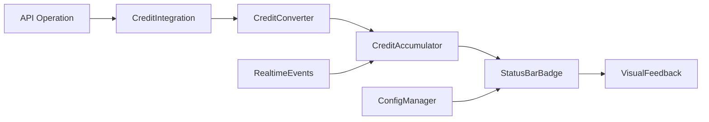

# Credit Badge System Documentation

## Overview

The Credit Badge System provides real-time visual feedback for credit consumption in the VSCode extension, displaying "X credits consumed" instead of dollar amounts with rich visual feedback and configuration options.

## Architecture

### Core Components

1. **CreditConverter**: Handles USD-to-credit conversion with configurable rates and rounding
2. **CreditAccumulator**: Tracks session operations and credit usage in real-time
3. **BadgeConfigurationManager**: Manages user preferences and system settings
4. **StatusBarBadge**: Displays credit information in the VSCode status bar
5. **VisualFeedbackManager**: Provides animations, colors, and notifications
6. **CreditBadgeManager**: Main controller that orchestrates all components

### Data Flow



## Features

### Display Modes

- **Session Mode**: Shows credits used in current session (`$(coin) 8 credits used`)
- **Rate Mode**: Shows operations per hour (`$(coin) 36.0/hr operations`)
- **Total Mode**: Shows total account balance
- **Remaining Mode**: Shows remaining credit balance

### Visual Feedback

- **Color Coding**: Progressive color changes based on usage levels
    - Green (0-5 credits): Low usage
    - Yellow (6-15 credits): Medium usage
    - Orange (16-30 credits): High usage
    - Red (31+ credits): Critical usage
- **Animations**: Credit consumption animations with spinning coin icon
- **Notifications**: Contextual notifications for significant events
- **Tooltips**: Rich tooltips with detailed statistics

### Configuration Options

```json
{
	"softcodes.creditBadge.displayMode": "session",
	"softcodes.creditBadge.dollarToCreditRate": 0.014,
	"softcodes.creditBadge.roundingMode": "ceil",
	"softcodes.creditBadge.notificationThreshold": 10,
	"softcodes.creditBadge.enableNotifications": true,
	"softcodes.creditBadge.showProgressAnimation": true
}
```

## Usage

### Basic Setup

The system is automatically initialized when the extension activates. No manual setup required.

### Integration with Existing Credit System

The badge system integrates seamlessly with the existing credit management:

```typescript
// In CreditIntegration.executeAPICallWithCredits()
// After successful credit deduction:
this.badgeManager.addOperation(operation, operationCost, {
	executionTime,
	transactionId: deductionResult.transactionId,
})
```

### Manual Operation Tracking

```typescript
import { CreditBadgeManager } from "./services/creditBadge"

const badgeManager = CreditBadgeManager.getInstance(context)

// Track custom operation
badgeManager.addOperation("CUSTOM_ANALYSIS", 0.025, {
	customData: "metadata",
})
```

## API Reference

### CreditConverter

```typescript
convertUSDToCredits(usdAmount: number): ConversionResult
convertCreditsToUSD(credits: number): number
convertOperationsToCredits(operations: Operation[]): ConversionSummary
updateConfig(newConfig: Partial<ConversionConfig>): void
```

### CreditAccumulator

```typescript
addOperation(operation: string, usdCost: number, metadata?: any): SessionOperation
getSessionStats(): SessionStats
resetSession(): void
getRecentOperations(count: number): SessionOperation[]
getOperationsByType(operationType: string): SessionOperation[]
```

### CreditBadgeManager

```typescript
initialize(): Promise<void>
addOperation(operation: string, usdCost: number, metadata?: any): void
showCreditConsumption(creditsUsed: number, operation: string): void
resetSession(): void
getSessionStats(): SessionStats
showDetails(): void
updateConfiguration(updates: Partial<BadgeConfiguration>): void
```

## Commands

The system registers the following VSCode commands:

- `softcodes.creditBadge.showDetails` - Show detailed credit breakdown
- `softcodes.creditBadge.resetSession` - Reset current session
- `softcodes.creditBadge.showHistory` - Show credit history (placeholder)
- `softcodes.creditBadge.setUsageLimit` - Set session credit limit

## Configuration

### Display Settings

- **Display Mode**: Choose what the badge shows

    - `session`: Credits used in current session
    - `rate`: Operations per hour
    - `total`: Total account balance
    - `remaining`: Remaining credits

- **Conversion Rate**: `dollarToCreditRate` (default: 0.014)
- **Rounding Mode**: How to handle fractional credits
    - `ceil`: Always round up (default)
    - `floor`: Always round down
    - `round`: Standard rounding

### Visual Settings

- **Notifications**: Enable/disable credit usage notifications
- **Animation**: Enable/disable progress animations
- **Threshold**: Credit amount that triggers notifications (default: 10)

### Example Configuration

```json
{
	"softcodes.creditBadge.displayMode": "session",
	"softcodes.creditBadge.dollarToCreditRate": 0.01,
	"softcodes.creditBadge.roundingMode": "round",
	"softcodes.creditBadge.notificationThreshold": 15,
	"softcodes.creditBadge.enableNotifications": true,
	"softcodes.creditBadge.showProgressAnimation": false
}
```

## Examples

### Badge Display Examples

1. **Session Mode**: `$(coin) 12 credits used`
2. **Rate Mode**: `$(coin) 24.5/hr operations`
3. **Animation**: `$(sync~spin) +5 credits` (temporary during consumption)

### Tooltip Example

```
Session Credits: 12 (4 operations)
Duration: 15m 32s
Average: 3.0 credits/operation
Total Cost: $0.168
Rate: 15.5 operations/hour

Click for detailed breakdown
```

### Notification Examples

- **Medium Usage**: `💡 12 credits used - you're actively coding!`
- **High Usage**: `⚠️ Credits: 28 used this session`
- **Critical Usage**: `🚨 High credit usage: 52 credits used this session`
- **Milestone**: `🎉 Milestone reached: 25 credits used!`

## Cost Calculation Examples

### Operation Costs (from API_COSTS)

```typescript
SIMPLE_QUERY: 0.014,      // 1 credit
CODE_GENERATION: 0.070,   // 5 credits
CODE_ANALYSIS: 0.042,     // 3 credits
FILE_PROCESSING: 0.028,   // 2 credits
CHAT_MESSAGE: 0.014,      // 1 credit
TRANSLATION: 0.021,       // 1.5 → 2 credits (ceil)
```

### Conversion Examples

- `$0.014` → `1 credit` (exact match)
- `$0.020` → `2 credits` (1.43 → ceil → 2)
- `$0.025` → `2 credits` (1.79 → ceil → 2)
- `$0.070` → `5 credits` (exact match)

### Session Tracking Example

```
Operations performed:
1. Code Generation: $0.070 → 5 credits
2. Simple Query: $0.014 → 1 credit
3. Code Analysis: $0.042 → 3 credits

Session Total: $0.126 → 9 credits
Badge shows: "$(coin) 9 credits used"
```

## Best Practices

1. **Configure Appropriate Thresholds**: Set notification thresholds based on your usage patterns
2. **Use Session Mode for Development**: Track credits per coding session
3. **Enable Animations for Awareness**: Visual feedback helps maintain credit awareness
4. **Regular Session Resets**: Start fresh sessions for different projects
5. **Monitor Efficiency**: Use rate mode to optimize usage patterns

## Troubleshooting

### Common Issues

**Badge Not Updating**

- Check if tracking is enabled in configuration
- Verify extension is properly activated
- Check console for initialization errors

**Incorrect Credit Calculations**

- Verify conversion rate setting (`softcodes.creditBadge.dollarToCreditRate`)
- Check rounding mode configuration
- Review operation costs in API_COSTS

**Missing Notifications**

- Ensure notifications are enabled
- Check notification threshold setting
- Verify operations exceed threshold

### Debug Mode

Enable debug logging by setting the configuration option:

```json
{
	"softcodes.creditBadge.debugMode": true
}
```

## Integration Guide

### With Existing Credit System

The badge system automatically integrates with the existing credit management system through `CreditIntegration.executeAPICallWithCredits()`.

### Custom Operations

Add custom operations to tracking:

```typescript
const badgeManager = CreditBadgeManager.getInstance(context)
badgeManager.addOperation("CUSTOM_ANALYSIS", 0.025, { customData: true })
```

### Configuration Updates

Update configuration programmatically:

```typescript
badgeManager.updateConfiguration({
	displayMode: "rate",
	notificationThreshold: 20,
})
```

## Testing

Run the comprehensive test suite:

```bash
# Test all credit badge components
cd src && npx vitest services/creditBadge/__tests__/

# Test specific component
cd src && npx vitest services/creditBadge/__tests__/CreditConverter.test.ts
cd src && npx vitest services/creditBadge/__tests__/CreditAccumulator.test.ts
```

### Test Coverage

- ✅ CreditConverter: 20 tests covering conversion logic and rounding modes
- ✅ CreditAccumulator: 19 tests covering session tracking and statistics
- ✅ All edge cases: Zero costs, negative amounts, large values
- ✅ Configuration updates and event handling
- ✅ Real-time synchronization and mismatch detection

## Migration from USD Display

If migrating from displaying dollar amounts to credit units:

1. Update display preferences: `"displayMode": "session"`
2. Configure appropriate conversion rate: `"dollarToCreditRate": 0.014`
3. Test with small operations first
4. Adjust notification thresholds: `"notificationThreshold": 10`

Existing settings will be automatically migrated with sensible defaults.

## Support

For issues or feature requests related to the credit badge system:

1. Check the troubleshooting section above
2. Enable debug mode for detailed logging
3. Review the console output for error messages
4. Refer to the main project documentation
