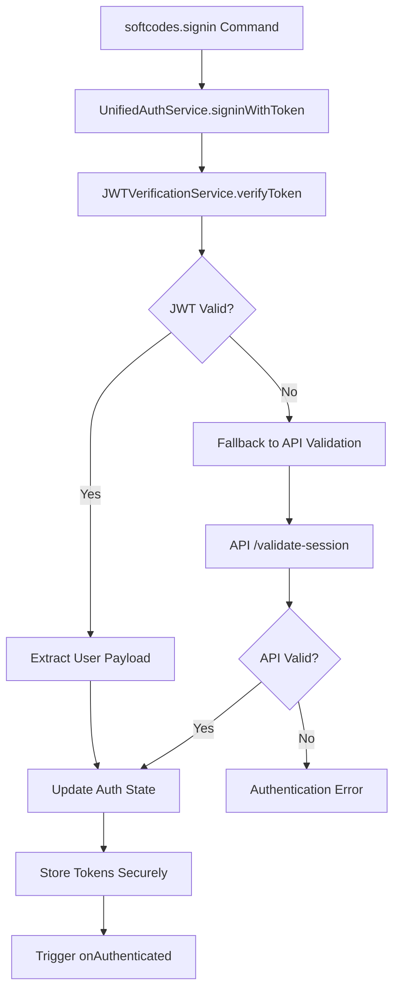

# JWT Token Decryption and Verification Implementation Plan

## Overview

This document outlines the implementation plan for JWT token decryption and verification for the `softcodes.signin` command using Clerk's authentication service. The implementation will provide client-side JWT verification with fallback to API validation for backward compatibility.

## Architecture Components

### 1. Dependencies

**Required NPM Packages:**

```json
{
	"@clerk/backend": "^1.0.0",
	"jsonwebtoken": "^9.0.0",
	"jwks-client": "^3.0.0"
}
```

### 2. New Files Structure

```
src/auth/
├── jwtVerification.ts          # Main JWT verification service
├── clerkJWKSClient.ts         # Clerk JWKS client wrapper
├── jwtTypes.ts                # JWT payload type definitions
├── jwtStorage.ts              # Secure JWT storage utilities
└── __tests__/
    ├── jwtVerification.test.ts
    ├── clerkJWKSClient.test.ts
    └── jwtIntegration.test.ts
```

### 3. JWT Verification Flow



## Implementation Details

### 1. JWT Verification Service (`src/auth/jwtVerification.ts`)

**Core Functions:**

- `verifyJWTToken(token: string): Promise<ClerkJWTPayload>`
- `validateTokenExpiration(payload: ClerkJWTPayload): boolean`
- `extractUserDataFromPayload(payload: ClerkJWTPayload): UserInfo`
- `isTokenNearExpiration(payload: ClerkJWTPayload): boolean`

**Security Features:**

- JWKS-based signature verification
- Claims validation (iss, aud, exp, iat)
- Token expiration and not-before checks
- Custom Clerk claims validation

### 2. Clerk JWKS Client (`src/auth/clerkJWKSClient.ts`)

**Features:**

- Fetch Clerk's public keys from JWKS endpoint
- Key caching with TTL (1 hour)
- Automatic key rotation handling
- Error handling for JWKS fetch failures

### 3. JWT Types (`src/auth/jwtTypes.ts`)

```typescript
interface ClerkJWTPayload {
	// Standard JWT claims
	iss: string // Issuer (Clerk)
	sub: string // Subject (user ID)
	aud: string // Audience
	exp: number // Expiration time
	iat: number // Issued at
	nbf?: number // Not before

	// Clerk-specific claims
	email: string
	email_verified: boolean
	first_name?: string
	last_name?: string
	image_url?: string

	// Organization data
	org_id?: string
	org_slug?: string
	org_role?: string

	// Session data
	session_id: string

	// Custom softcodes claims
	softcodes_user_id?: string
	subscription_status?: string
}

interface JWTVerificationResult {
	valid: boolean
	payload?: ClerkJWTPayload
	error?: JWTVerificationError
}

enum JWTVerificationError {
	INVALID_SIGNATURE = "INVALID_SIGNATURE",
	TOKEN_EXPIRED = "TOKEN_EXPIRED",
	INVALID_CLAIMS = "INVALID_CLAIMS",
	JWKS_FETCH_ERROR = "JWKS_FETCH_ERROR",
	MALFORMED_TOKEN = "MALFORMED_TOKEN",
}
```

### 4. Enhanced signinWithToken Method

**Updated Flow:**

1. Prompt user for JWT token
2. Attempt JWT verification first
3. If JWT valid: extract payload and update auth state
4. If JWT invalid: fallback to existing API validation
5. Store tokens securely
6. Trigger authentication success events

**Error Handling:**

- Graceful degradation to API validation
- Clear error messages for different failure types
- Proper logging for debugging without exposing sensitive data

### 5. Configuration Updates (`src/auth/config.ts`)

**New Configuration:**

```typescript
export const JWT_CONFIG = {
	CLERK_JWKS_URL: "https://clerk.softcodes.ai/.well-known/jwks.json",
	ISSUER: "https://clerk.softcodes.ai",
	AUDIENCE: "softcodes-vscode-extension",
	CLOCK_TOLERANCE: 60, // seconds
	CACHE_TTL: 3600, // 1 hour in seconds
	TOKEN_REFRESH_THRESHOLD: 300, // Refresh if expires within 5 minutes
} as const
```

## Security Considerations

### 1. JWT Verification Security

- Verify JWT signature using Clerk's public keys
- Validate all standard JWT claims (iss, aud, exp, iat, nbf)
- Check custom Clerk-specific claims
- Protect against JWT tampering and replay attacks

### 2. Token Storage Security

- Use VSCode's secrets API for secure storage
- Encrypt sensitive token data
- Implement proper token cleanup on signout

### 3. Error Handling Security

- Avoid exposing sensitive information in error messages
- Log security events for monitoring
- Implement rate limiting for verification attempts

## Performance Optimizations

### 1. JWKS Caching

- Cache Clerk's public keys for 1 hour
- Implement efficient key lookup
- Background key refresh

### 2. Async Operations

- Non-blocking JWT verification
- Parallel API calls where possible
- Efficient token validation

## Testing Strategy

### 1. Unit Tests

- JWT signature verification with various key scenarios
- Claims validation with edge cases
- Token expiration and refresh logic
- Error handling for all failure modes

### 2. Integration Tests

- Complete authentication flow with mock Clerk
- Fallback to API validation scenarios
- Token storage and retrieval
- Performance testing for JWT verification

### 3. Security Tests

- Invalid token scenarios
- Tampered JWT signatures
- Expired token handling
- JWKS endpoint failure scenarios

## Backward Compatibility

### 1. Fallback Strategy

- Maintain existing API validation as fallback
- Support both JWT and API-based validation
- Graceful degradation for unsupported tokens

### 2. Migration Path

- Gradual rollout of JWT verification
- Clear documentation for token format changes
- Support for legacy authentication methods

## Error Messages and User Experience

### 1. User-Friendly Messages

- "Invalid authentication token. Please check your token and try again."
- "Your session has expired. Please sign in again."
- "Unable to verify authentication. Trying alternative method..."

### 2. Developer Debugging

- Detailed error logging with JWT verification details
- Performance metrics for verification operations
- Security event logging

## Implementation Timeline

### Phase 1: Core JWT Verification (Days 1-2)

1. Install Clerk SDK dependencies
2. Create JWT verification service
3. Implement JWKS client
4. Add JWT type definitions

### Phase 2: Integration and Enhancement (Days 3-4)

5. Enhance signinWithToken method
6. Update authentication state management
7. Add comprehensive error handling
8. Implement token refresh logic

### Phase 3: Testing and Documentation (Days 5-6)

9. Create comprehensive test coverage
10. Update ApiClient error handling
11. Add detailed logging and debugging
12. Update documentation

## Success Criteria

### ✅ Functional Requirements

- [ ] JWT tokens can be verified using Clerk's public keys
- [ ] User data is correctly extracted from verified JWT payload
- [ ] Fallback to API validation works seamlessly
- [ ] Token expiration is handled gracefully
- [ ] Authentication state is properly managed

### ✅ Security Requirements

- [ ] JWT signatures are properly validated
- [ ] Token tampering is detected and rejected
- [ ] Sensitive data is securely stored
- [ ] Error handling doesn't leak sensitive information

### ✅ Performance Requirements

- [ ] JWT verification completes within 200ms
- [ ] JWKS keys are efficiently cached
- [ ] No blocking operations in UI thread

### ✅ Compatibility Requirements

- [ ] Existing authentication flows continue to work
- [ ] Backward compatibility with API validation
- [ ] No breaking changes to current user sessions

This implementation plan provides a comprehensive, secure, and maintainable JWT verification system that enhances the current authentication while maintaining backward compatibility.
