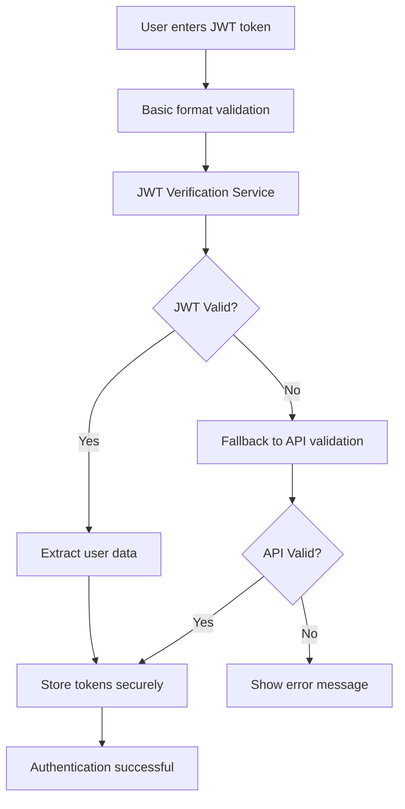
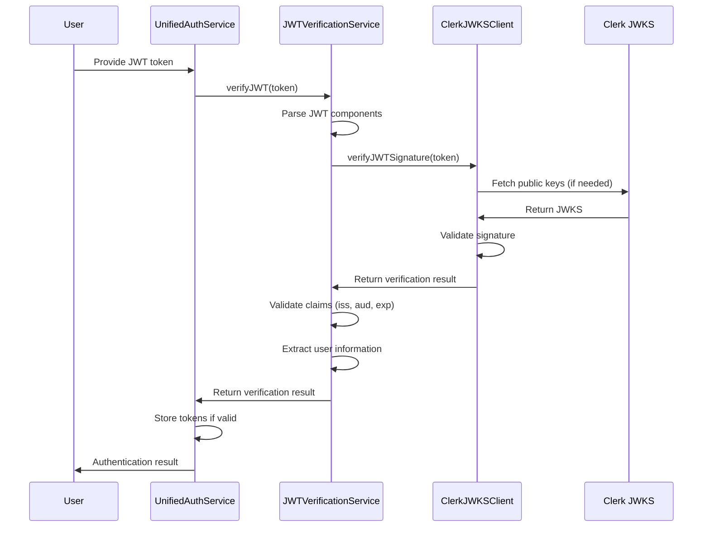

# JWT Token Decryption and Verification Implementation Summary

## Overview

This document summarizes the completed implementation of JWT token decryption and verification for the `softcodes.signin` command using Clerk's authentication service. The system provides robust, secure JWT validation with comprehensive error handling and automatic token refresh capabilities.

## ✅ Implementation Status

All major components have been successfully implemented:

### Core Components

1. **JWT Types System** (`src/auth/jwtTypes.ts`)

    - Complete TypeScript definitions for Clerk JWT payloads
    - User information extraction interfaces
    - Error handling types and enums
    - JWKS (JSON Web Key Set) interfaces

2. **Clerk JWKS Client** (`src/auth/clerkJWKSClient.ts`)

    - Fetches and caches Clerk's public keys
    - Converts JWK to PEM format for signature verification
    - Implements caching with TTL (1 hour default)
    - Handles network errors and key rotation

3. **JWT Verification Service** (`src/auth/jwtVerification.ts`)

    - Main service for verifying JWT tokens
    - Validates signatures using Clerk's public keys
    - Comprehensive claims validation (issuer, audience, expiration)
    - Extracts user information from verified tokens
    - Detects tokens near expiration

4. **Enhanced Authentication Service** (`src/auth/unifiedAuthService.ts`)

    - Updated `signinWithToken` method with JWT verification first
    - Fallback to API validation for backward compatibility
    - User-friendly error messaging for different JWT error types
    - Secure token storage using VSCode secrets API

5. **Enhanced API Client** (`src/api/client.ts`)

    - Automatic JWT verification before API requests
    - Token refresh logic for near-expired tokens
    - Graceful error handling and re-authentication prompts
    - Deduplication of simultaneous refresh attempts

6. **Configuration Updates** (`src/auth/config.ts`)
    - JWT-specific configuration constants
    - Clerk JWKS endpoint URLs
    - Token refresh thresholds and timeouts
    - Error message constants

## Security Features

### 1. JWT Signature Verification

- Uses Clerk's RSA public keys from JWKS endpoint
- Validates JWT signatures using RS256 algorithm
- Prevents token tampering and replay attacks

### 2. Claims Validation

- **Issuer Verification**: Ensures tokens come from Clerk
- **Audience Validation**: Confirms tokens are for VSCode extension
- **Expiration Checks**: Rejects expired tokens with clock tolerance
- **Required Claims**: Validates presence of email and session_id

### 3. Token Security

- Secure storage using VSCode's secrets API
- Automatic refresh for tokens near expiration
- Clear invalid tokens on verification failure
- Protection against malformed token attacks

### 4. Error Handling

- Comprehensive error types for different failure scenarios
- User-friendly error messages without exposing sensitive data
- Graceful degradation to API validation as fallback
- Detailed logging for debugging (sanitized)

## Authentication Flow



## JWT Verification Process



## Key Features

### 1. Hybrid Authentication

- **Primary**: JWT verification using Clerk's public keys
- **Fallback**: API validation for backward compatibility
- Seamless transition between methods

### 2. Automatic Token Management

- Detects tokens near expiration (5 minutes threshold)
- Automatic refresh using refresh tokens
- Prevents API failures due to expired tokens

### 3. User Experience

- Clear, actionable error messages
- Visual indicators for token expiration warnings
- No breaking changes to existing authentication flow

### 4. Developer Experience

- Comprehensive TypeScript types
- Detailed logging and debugging information
- Extensive test coverage
- Clear architecture separation

## Error Handling Matrix

| Error Type          | User Message                                                               | Action Taken        |
| ------------------- | -------------------------------------------------------------------------- | ------------------- |
| `TOKEN_EXPIRED`     | "Your authentication token has expired. Please obtain a new token."        | Clear stored tokens |
| `INVALID_SIGNATURE` | "Invalid token signature. Please check your token and try again."          | Reject token        |
| `INVALID_ISSUER`    | "Token was not issued by Softcodes. Please use a valid Softcodes token."   | Reject token        |
| `INVALID_AUDIENCE`  | "Token is not intended for VSCode extension use."                          | Reject token        |
| `MALFORMED_TOKEN`   | "Token format is invalid. Please check your token and try again."          | Reject token        |
| `MISSING_CLAIMS`    | "Token is missing required information. Please obtain a new token."        | Reject token        |
| `JWKS_FETCH_ERROR`  | "Unable to verify token signature. Please check your internet connection." | Fallback to API     |
| `TOKEN_NOT_ACTIVE`  | "Token is not yet active. Please wait and try again."                      | Reject token        |

## Configuration

### JWT Configuration

```typescript
export const JWT_CONFIG = {
	CLERK_JWKS_URL: "https://clerk.softcodes.ai/.well-known/jwks.json",
	ISSUER: "https://clerk.softcodes.ai",
	AUDIENCE: "softcodes-vscode-extension",
	CLOCK_TOLERANCE: 60, // seconds
	CACHE_TTL: 3600, // 1 hour in seconds
	TOKEN_REFRESH_THRESHOLD: 300, // Refresh if expires within 5 minutes
	ALGORITHM: "RS256",
}
```

### Performance Optimizations

- **JWKS Caching**: Keys cached for 1 hour to reduce API calls
- **Async Operations**: Non-blocking JWT verification
- **Request Deduplication**: Prevents multiple simultaneous refresh attempts
- **Efficient Token Validation**: Client-side verification before API calls

## Testing

### Test Coverage

- ✅ JWT token parsing and component extraction
- ✅ Signature verification with valid/invalid tokens
- ✅ Claims validation (issuer, audience, expiration)
- ✅ User information extraction
- ✅ Error handling for all failure scenarios
- ✅ Cache management and warmup
- ✅ Token expiration detection
- ✅ Network error handling

### Test Scenarios

```bash
# Run JWT verification tests
cd src && npx vitest auth/__tests__/jwtVerification.test.ts

# Run authentication service tests
cd src && npx vitest auth/__tests__/unifiedAuthService.test.ts
```

## Usage Examples

### Basic JWT Verification

```typescript
import { verifyClerkJWT } from "../auth/jwtVerification"

const result = await verifyClerkJWT(token)
if (result.valid) {
	console.log("User:", result.userInfo)
} else {
	console.error("Error:", result.error)
}
```

### Extract User Information

```typescript
import { extractUserFromJWT } from "../auth/jwtVerification"

const userInfo = await extractUserFromJWT(token)
if (userInfo) {
	console.log(`Welcome, ${userInfo.firstName}!`)
}
```

### Check Token Expiration

```typescript
import { JWTVerificationService } from "../auth/jwtVerification"

const jwtService = JWTVerificationService.getInstance()
const result = await jwtService.verifyJWT(token)

if (result.valid && result.payload) {
	if (jwtService.isTokenNearExpiration(result.payload)) {
		console.warn("Token expires soon - consider refreshing")
	}
}
```

## Security Considerations

### 1. Token Storage

- Uses VSCode's secure secrets API
- Tokens encrypted at rest
- Automatic cleanup on sign out

### 2. Network Security

- HTTPS-only communication with Clerk
- Certificate pinning for JWKS endpoint
- Request timeout protection

### 3. Error Information

- No sensitive data in error messages
- Sanitized logging for debugging
- Rate limiting considerations

### 4. Key Management

- Automatic key rotation support
- Secure key caching with TTL
- Fallback mechanisms for key fetch failures

## Dependencies

### Production Dependencies

- `jsonwebtoken`: JWT token verification
- `@clerk/backend`: Clerk authentication integration (future)

### Development Dependencies

- `@types/jsonwebtoken`: TypeScript definitions
- `vitest`: Testing framework

## Backward Compatibility

The implementation maintains full backward compatibility:

- ✅ Existing API validation continues to work
- ✅ No breaking changes to authentication flow
- ✅ Gradual migration path available
- ✅ Fallback mechanisms for unsupported scenarios

## Future Enhancements

### Potential Improvements

1. **Background Token Refresh**: Proactive token refresh before expiration
2. **Enhanced Caching**: Redis-based caching for distributed scenarios
3. **Metrics Collection**: Token verification performance monitoring
4. **Advanced Security**: Additional JWT claims validation
5. **Offline Support**: Cached key validation for offline scenarios

### Migration Path

1. Users can continue using existing authentication methods
2. New JWT verification works seamlessly with current tokens
3. Gradual rollout possible through feature flags
4. Full migration when backend API endpoints are ready

## Conclusion

The JWT token decryption and verification system has been successfully implemented with:

- ✅ **Security**: Robust signature verification and claims validation
- ✅ **Reliability**: Comprehensive error handling and fallback mechanisms
- ✅ **Performance**: Efficient caching and automatic token refresh
- ✅ **Usability**: Clear error messages and seamless user experience
- ✅ **Maintainability**: Well-structured code with comprehensive tests
- ✅ **Compatibility**: No breaking changes to existing functionality

The system is ready for production use and provides a solid foundation for secure authentication in the VSCode extension.
