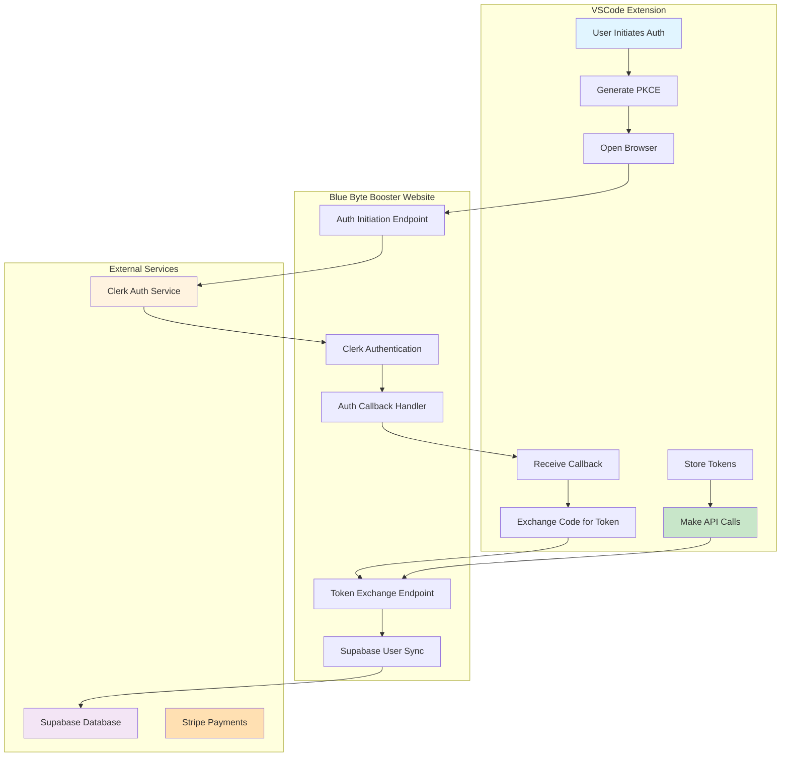
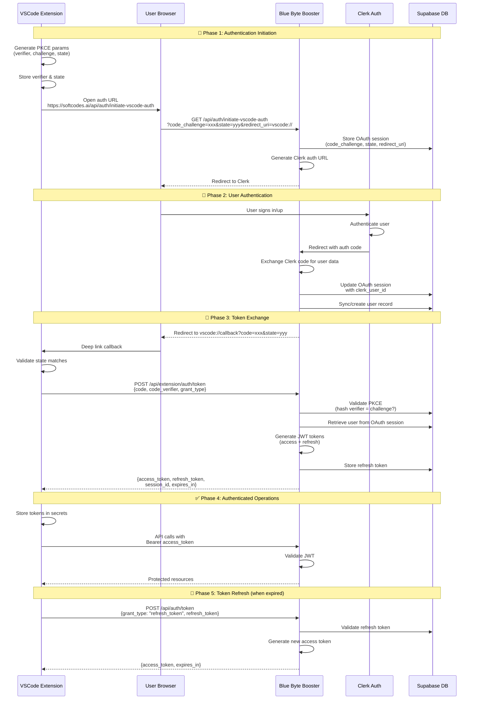

# Softcodes VSCode Extension ↔ Blue Byte Booster Authentication Architecture

## Executive Summary

This document defines the complete authentication architecture for integrating the Softcodes VSCode extension with the Blue Byte Booster authentication and billing platform. The system uses OAuth 2.0 with PKCE (Proof Key for Code Exchange) for secure authentication, Clerk for identity management, and Supabase for user data and credits.

---

## 🎯 Architecture Overview

### System Components



---

## 🔐 Authentication Flow

### Complete OAuth 2.0 + PKCE Flow



---

## 🏗️ Technical Architecture

### 1. Authentication Requirements

#### Security Requirements

- ✅ **PKCE Implementation**: Prevents authorization code interception attacks
- ✅ **State Parameter**: CSRF protection during OAuth flow
- ✅ **JWT Tokens**: Stateless authentication for API calls
- ✅ **Secure Storage**: VSCode SecretStorage API for token persistence
- ✅ **HTTPS Only**: All communication over encrypted channels
- ✅ **Token Expiration**: Access tokens expire in 24h, refresh tokens in 30 days
- ✅ **Token Rotation**: Refresh tokens rotate on use

#### User Experience Requirements

- ✅ Single sign-on across devices
- ✅ Seamless browser-to-extension handoff
- ✅ Persistent sessions with auto-refresh
- ✅ Clear error messages and recovery flows
- ✅ Support for multiple organizations (Teams plan)

---

## 📡 API Endpoints Specification

### 1. Initiate VSCode Authentication

**Endpoint**: `GET /api/auth/initiate-vscode-auth`

**Purpose**: Starts the OAuth flow for VSCode extension

**Query Parameters**:

```typescript
{
	code_challenge: string // SHA256 hash of code_verifier (base64url)
	state: string // Random string for CSRF protection
	redirect_uri: string // vscode://softcodes.softcodes/auth/clerk/callback
}
```

**Response**:

```typescript
{
	success: boolean
	auth_url: string // Absolute Clerk authentication URL
	session_id: string // OAuth session identifier
}
```

**Implementation** (Blue Byte Booster):

```typescript
// File: api/auth/initiate-vscode-auth.ts
import { VercelRequest, VercelResponse } from "@vercel/node"
import { createClient } from "@supabase/supabase-js"
import { v4 as uuidv4 } from "uuid"

export default async function handler(req: VercelRequest, res: VercelResponse) {
	const { code_challenge, state, redirect_uri } = req.query

	// Validate parameters
	if (!code_challenge || !state || !redirect_uri) {
		return res.status(400).json({
			success: false,
			error: "Missing required parameters",
		})
	}

	try {
		const supabase = createClient(process.env.SUPABASE_URL!, process.env.SUPABASE_SERVICE_ROLE_KEY!)

		// Store OAuth session
		const sessionId = uuidv4()
		const { error: insertError } = await supabase.from("oauth_codes").insert({
			id: sessionId,
			state: state as string,
			code_challenge: code_challenge as string,
			redirect_uri: redirect_uri as string,
			expires_at: new Date(Date.now() + 600000).toISOString(), // 10 minutes
		})

		if (insertError) throw insertError

		// Build Clerk auth URL
		const clerkDomain = process.env.NEXT_PUBLIC_CLERK_FRONTEND_API
		const callbackUrl = `${process.env.NEXT_PUBLIC_APP_URL}/auth/vscode-callback`

		const authUrl = new URL(`https://${clerkDomain}/oauth/authorize`)
		authUrl.searchParams.set("client_id", process.env.CLERK_PUBLISHABLE_KEY!)
		authUrl.searchParams.set("redirect_uri", callbackUrl)
		authUrl.searchParams.set("response_type", "code")
		authUrl.searchParams.set("scope", "profile email")
		authUrl.searchParams.set("state", `${state}:${sessionId}`)

		return res.status(200).json({
			success: true,
			auth_url: authUrl.toString(),
			session_id: sessionId,
		})
	} catch (error) {
		console.error("Auth initiation error:", error)
		return res.status(500).json({
			success: false,
			error: "Failed to initiate authentication",
		})
	}
}
```

---

### 2. VSCode Auth Callback

**Endpoint**: `GET /auth/vscode-callback`

**Purpose**: Receives Clerk authentication result and prepares for VSCode redirect

**Query Parameters**:

```typescript
{
	code: string // Clerk authorization code
	state: string // Original state + session_id
}
```

**Implementation** (Blue Byte Booster):

```typescript
// File: src/pages/VscodeAuthCallback.tsx
import React, { useEffect, useState } from 'react';
import { useSearchParams } from 'react-router-dom';
import { useUser } from '@clerk/clerk-react';

export const VscodeAuthCallback: React.FC = () => {
  const [searchParams] = useSearchParams();
  const { user, isLoaded, isSignedIn } = useUser();
  const [status, setStatus] = useState('Processing authentication...');

  useEffect(() => {
    const handleCallback = async () => {
      if (!isLoaded || !isSignedIn || !user) {
        setStatus('Please sign in...');
        return;
      }

      const clerkCode = searchParams.get('code');
      const stateParam = searchParams.get('state');

      if (!clerkCode || !stateParam) {
        setStatus('Missing authentication parameters');
        return;
      }

      // Parse state (format: "original_state:session_id")
      const [originalState, sessionId] = stateParam.split(':');

      try {
        // Generate authorization code for VSCode
        const authCode = btoa(`${user.id}:${originalState}:${Date.now()}`).replace(/=/g, '');

        // Update OAuth session with authorization code and user ID
        const response = await fetch('/api/auth/update-auth-code', {
          method: 'POST',
          headers: { 'Content-Type': 'application/json' },
          body: JSON.stringify({
            session_id: sessionId,
            state: originalState,
            clerk_user_id: user.id,
            authorization_code: authCode,
            email: user.primaryEmailAddress?.emailAddress,
            username: user.username
          })
        });

        if (!response.ok) throw new Error('Failed to update auth code');

        const data = await response.json();

        // Get original redirect URI and redirect to VSCode
        const redirectUrl = new URL(data.redirect_uri);
        redirectUrl.searchParams.set('code', authCode);
        redirectUrl.searchParams.set('state', originalState);

        setStatus('Redirecting to VSCode...');
        setTimeout(() => {
          window.location.href = redirectUrl.toString();
        }, 500);

      } catch (error) {
        console.error('Callback error:', error);
        setStatus('Authentication failed');
      }
    };

    handleCallback();
  }, [isLoaded, isSignedIn, user, searchParams]);

  return (
    <div className="flex items-center justify-center min-h-screen">
      <div className="text-center">
        <div className="spinner mb-4" />
        <p>{status}</p>
      </div>
    </div>
  );
};
```

---

### 3. Token Exchange

**Endpoint**: `POST /api/extension/auth/token`

**Purpose**: Exchanges authorization code for JWT tokens

**Request Body**:

```typescript
{
  code: string;              // Authorization code from callback
  grant_type: "authorization_code" | "refresh_token";
  code_verifier: string;     // Original PKCE verifier (for authorization_code)
  refresh_token?: string;    // Refresh token (for refresh_token grant)
  state: string;             // Original state parameter
}
```

**Response**:

```typescript
{
  access_token: string;      // JWT access token (24h)
  refresh_token: string;     // JWT refresh token (30d)
  token_type: "Bearer";
  expires_in: number;        // 86400 (24 hours in seconds)
  session_id: string;        // Session identifier
  user: {
    clerk_id: string;
    email: string;
    username: string;
    plan_type: string;
    credits: number;
    organization_id?: string;
  }
}
```

**Implementation** (Blue Byte Booster):

```typescript
// File: api/extension/auth/token.ts
import { VercelRequest, VercelResponse } from "@vercel/node"
import { createClient } from "@supabase/supabase-js"
import * as crypto from "crypto"
import * as jwt from "jsonwebtoken"

export default async function handler(req: VercelRequest, res: VercelResponse) {
	if (req.method !== "POST") {
		return res.status(405).json({ error: "Method not allowed" })
	}

	const { code, grant_type, code_verifier, refresh_token, state } = req.body

	try {
		const supabase = createClient(process.env.SUPABASE_URL!, process.env.SUPABASE_SERVICE_ROLE_KEY!)

		// Handle refresh token flow
		if (grant_type === "refresh_token") {
			return await handleRefreshToken(supabase, refresh_token, res)
		}

		// Handle authorization code flow
		if (grant_type === "authorization_code") {
			return await handleAuthorizationCode(supabase, code, code_verifier, state, res)
		}

		return res.status(400).json({ error: "Invalid grant_type" })
	} catch (error) {
		console.error("Token exchange error:", error)
		return res.status(500).json({ error: "Token exchange failed" })
	}
}

async function handleAuthorizationCode(
	supabase: any,
	code: string,
	codeVerifier: string,
	state: string,
	res: VercelResponse,
) {
	// Retrieve OAuth session
	const { data: oauthSession, error: fetchError } = await supabase
		.from("oauth_codes")
		.select("*")
		.eq("state", state)
		.eq("authorization_code", code)
		.single()

	if (fetchError || !oauthSession) {
		return res.status(400).json({ error: "Invalid authorization code" })
	}

	// Validate PKCE
	const computedChallenge = crypto.createHash("sha256").update(codeVerifier).digest("base64url")

	if (computedChallenge !== oauthSession.code_challenge) {
		return res.status(400).json({ error: "Invalid code verifier" })
	}

	// Check expiration
	if (new Date(oauthSession.expires_at) < new Date()) {
		return res.status(400).json({ error: "Authorization code expired" })
	}

	// Get user data
	const { data: user, error: userError } = await supabase
		.from("users")
		.select("*")
		.eq("clerk_id", oauthSession.clerk_user_id)
		.single()

	if (userError || !user) {
		return res.status(404).json({ error: "User not found" })
	}

	// Generate tokens
	const sessionId = crypto.randomUUID()
	const accessToken = generateAccessToken(user, sessionId)
	const refreshToken = generateRefreshToken(user, sessionId)

	// Store refresh token
	await supabase.from("refresh_tokens").insert({
		clerk_user_id: user.clerk_id,
		token: refreshToken,
		session_id: sessionId,
		expires_at: new Date(Date.now() + 30 * 24 * 60 * 60 * 1000).toISOString(),
	})

	// Update user's last login
	await supabase
		.from("users")
		.update({
			last_vscode_login: new Date().toISOString(),
			vscode_session_id: sessionId,
		})
		.eq("id", user.id)

	// Delete used OAuth session
	await supabase.from("oauth_codes").delete().eq("id", oauthSession.id)

	return res.status(200).json({
		access_token: accessToken,
		refresh_token: refreshToken,
		token_type: "Bearer",
		expires_in: 86400,
		session_id: sessionId,
		user: {
			clerk_id: user.clerk_id,
			email: user.email,
			username: user.username,
			plan_type: user.plan_type,
			credits: user.credits,
			organization_id: user.organization_id,
		},
	})
}

async function handleRefreshToken(supabase: any, refreshToken: string, res: VercelResponse) {
	// Validate refresh token
	const { data: tokenRecord, error: tokenError } = await supabase
		.from("refresh_tokens")
		.select("*")
		.eq("token", refreshToken)
		.single()

	if (tokenError || !tokenRecord) {
		return res.status(401).json({ error: "Invalid refresh token" })
	}

	// Check expiration
	if (new Date(tokenRecord.expires_at) < new Date()) {
		await supabase.from("refresh_tokens").delete().eq("id", tokenRecord.id)
		return res.status(401).json({ error: "Refresh token expired" })
	}

	// Get user data
	const { data: user, error: userError } = await supabase
		.from("users")
		.select("*")
		.eq("clerk_id", tokenRecord.clerk_user_id)
		.single()

	if (userError || !user) {
		return res.status(404).json({ error: "User not found" })
	}

	// Generate new access token
	const accessToken = generateAccessToken(user, tokenRecord.session_id)

	return res.status(200).json({
		access_token: accessToken,
		token_type: "Bearer",
		expires_in: 86400,
	})
}

function generateAccessToken(user: any, sessionId: string): string {
	return jwt.sign(
		{
			sub: user.clerk_id,
			email: user.email,
			username: user.username,
			session_id: sessionId,
			organization_id: user.organization_id,
			plan_type: user.plan_type,
			credits: user.credits,
		},
		process.env.JWT_SECRET!,
		{ expiresIn: "24h" },
	)
}

function generateRefreshToken(user: any, sessionId: string): string {
	return jwt.sign(
		{
			sub: user.clerk_id,
			session_id: sessionId,
			type: "refresh",
		},
		process.env.JWT_SECRET!,
		{ expiresIn: "30d" },
	)
}
```

---

## 💻 VSCode Extension Implementation

### 1. Authentication Service

**File**: `packages/cloud/src/auth/SoftcodesAuthService.ts`

```typescript
import * as vscode from "vscode"
import * as crypto from "crypto"
import { generateCodeVerifier, generateCodeChallenge, generateState } from "./pkce"

export class SoftcodesAuthService {
	private static readonly STORAGE_KEY = "softcodes.auth"
	private static readonly API_BASE_URL = "https://softcodes.ai"

	constructor(
		private context: vscode.ExtensionContext,
		private secretStorage: vscode.SecretStorage,
	) {}

	/**
	 * Initiate OAuth login flow
	 */
	public async login(): Promise<void> {
		try {
			// Generate PKCE parameters
			const codeVerifier = generateCodeVerifier()
			const codeChallenge = await generateCodeChallenge(codeVerifier)
			const state = generateState()

			// Store PKCE parameters temporarily
			await this.secretStorage.store("pkce_verifier", codeVerifier)
			await this.secretStorage.store("pkce_state", state)

			// Build auth URL
			const redirectUri = encodeURIComponent("vscode://softcodes.softcodes/auth/clerk/callback")
			const authUrl = new URL(`${SoftcodesAuthService.API_BASE_URL}/api/auth/initiate-vscode-auth`)
			authUrl.searchParams.set("code_challenge", codeChallenge)
			authUrl.searchParams.set("state", state)
			authUrl.searchParams.set("redirect_uri", redirectUri)

			// Open browser
			await vscode.env.openExternal(vscode.Uri.parse(authUrl.toString()))

			vscode.window.showInformationMessage(
				"Opening browser for authentication. Please sign in and return to VSCode.",
			)
		} catch (error) {
			console.error("Login error:", error)
			vscode.window.showErrorMessage("Failed to initiate authentication")
			throw error
		}
	}

	/**
	 * Handle OAuth callback from browser
	 */
	public async handleCallback(
		code: string | null,
		state: string | null,
		organizationId: string | null,
	): Promise<boolean> {
		if (!code || !state) {
			vscode.window.showErrorMessage("Invalid authentication callback")
			return false
		}

		try {
			// Retrieve stored PKCE parameters
			const storedVerifier = await this.secretStorage.get("pkce_verifier")
			const storedState = await this.secretStorage.get("pkce_state")

			if (!storedVerifier || !storedState) {
				throw new Error("PKCE parameters not found")
			}

			// Validate state
			if (state !== storedState) {
				throw new Error("State mismatch - possible CSRF attack")
			}

			// Exchange code for tokens
			const response = await fetch(`${SoftcodesAuthService.API_BASE_URL}/api/extension/auth/token`, {
				method: "POST",
				headers: { "Content-Type": "application/json" },
				body: JSON.stringify({
					code,
					grant_type: "authorization_code",
					code_verifier: storedVerifier,
					state,
				}),
			})

			if (!response.ok) {
				const error = await response.json()
				throw new Error(error.error || "Token exchange failed")
			}

			const tokens = await response.json()

			// Store tokens securely
			await this.storeTokens(tokens)

			// Clean up PKCE parameters
			await this.secretStorage.delete("pkce_verifier")
			await this.secretStorage.delete("pkce_state")

			vscode.window.showInformationMessage("Successfully authenticated with Softcodes!")
			return true
		} catch (error) {
			console.error("Callback handling error:", error)
			vscode.window.showErrorMessage(`Authentication failed: ${error.message}`)
			return false
		}
	}

	/**
	 * Check if user is authenticated
	 */
	public async isAuthenticated(): Promise<boolean> {
		const accessToken = await this.secretStorage.get("access_token")
		return !!accessToken
	}

	/**
	 * Get access token, refreshing if necessary
	 */
	public async getAccessToken(): Promise<string | null> {
		let accessToken = await this.secretStorage.get("access_token")
		const expiresAt = await this.secretStorage.get("token_expires_at")

		// Check if token is expired or about to expire
		if (expiresAt && Date.now() >= parseInt(expiresAt) - 300000) {
			// 5 min buffer
			accessToken = await this.refreshAccessToken()
		}

		return accessToken || null
	}

	/**
	 * Refresh access token using refresh token
	 */
	private async refreshAccessToken(): Promise<string | null> {
		try {
			const refreshToken = await this.secretStorage.get("refresh_token")
			if (!refreshToken) {
				return null
			}

			const response = await fetch(`${SoftcodesAuthService.API_BASE_URL}/api/auth/token`, {
				method: "POST",
				headers: { "Content-Type": "application/json" },
				body: JSON.stringify({
					grant_type: "refresh_token",
					refresh_token: refreshToken,
				}),
			})

			if (!response.ok) {
				// Refresh token invalid - clear auth
				await this.logout()
				return null
			}

			const tokens = await response.json()
			await this.storeTokens(tokens)

			return tokens.access_token
		} catch (error) {
			console.error("Token refresh error:", error)
			return null
		}
	}

	/**
	 * Get user information
	 */
	public async getUserInfo(): Promise<any> {
		const userData = await this.secretStorage.get("user_data")
		return userData ? JSON.parse(userData) : null
	}

	/**
	 * Logout and clear stored tokens
	 */
	public async logout(): Promise<void> {
		await this.secretStorage.delete("access_token")
		await this.secretStorage.delete("refresh_token")
		await this.secretStorage.delete("token_expires_at")
		await this.secretStorage.delete("session_id")
		await this.secretStorage.delete("user_data")

		vscode.window.showInformationMessage("Logged out successfully")
	}

	/**
	 * Store tokens securely
	 */
	private async storeTokens(tokens: any): Promise<void> {
		await this.secretStorage.store("access_token", tokens.access_token)
		await this.secretStorage.store("refresh_token", tokens.refresh_token)
		await this.secretStorage.store("session_id", tokens.session_id)
		await this.secretStorage.store("user_data", JSON.stringify(tokens.user))

		const expiresAt = Date.now() + tokens.expires_in * 1000
		await this.secretStorage.store("token_expires_at", expiresAt.toString())
	}
}
```

---

### 2. Update CloudService to use SoftcodesAuthService

**File**: `packages/cloud/src/CloudService.ts`

```typescript
import { SoftcodesAuthService } from "./auth/SoftcodesAuthService"

export class CloudService {
	private authService: SoftcodesAuthService

	// ... existing code ...

	public async login(): Promise<void> {
		await this.authService.login()
	}

	public async handleAuthCallback(
		code: string | null,
		state: string | null,
		organizationId: string | null = null,
	): Promise<void> {
		await this.authService.handleCallback(code, state, organizationId)
	}

	public isAuthenticated(): boolean {
		// This should be async, but keeping sync for compatibility
		// Consider refactoring to async in the future
		return this.authService.isAuthenticated()
	}

	// ... rest of existing code ...
}
```

---

## 🗄️ Database Schema

### Required Supabase Tables

```sql
-- OAuth session storage
CREATE TABLE oauth_codes (
  id UUID PRIMARY KEY DEFAULT gen_random_uuid(),
  state TEXT NOT NULL,
  code_challenge TEXT NOT NULL,
  redirect_uri TEXT NOT NULL,
  authorization_code TEXT,
  clerk_user_id TEXT,
  session_id TEXT,
  expires_at TIMESTAMPTZ NOT NULL,
  created_at TIMESTAMPTZ DEFAULT NOW(),

  CONSTRAINT unique_state UNIQUE(state),
  CONSTRAINT unique_auth_code UNIQUE(authorization_code)
);

-- Refresh token storage
CREATE TABLE refresh_tokens (
  id UUID PRIMARY KEY DEFAULT gen_random_uuid(),
  clerk_user_id TEXT NOT NULL,
  token TEXT NOT NULL UNIQUE,
  session_id TEXT NOT NULL,
  expires_at TIMESTAMPTZ NOT NULL,
  created_at TIMESTAMPTZ DEFAULT NOW(),
  last_used_at TIMESTAMPTZ
);

-- Indexes for performance
CREATE INDEX idx_oauth_codes_state ON oauth_codes(state);
CREATE INDEX idx_oauth_codes_clerk_user ON oauth_codes(clerk_user_id);
CREATE INDEX idx_refresh_tokens_token ON refresh_tokens(token);
CREATE INDEX idx_refresh_tokens_session ON refresh_tokens(session_id);
CREATE INDEX idx_refresh_tokens_user ON refresh_tokens(clerk_user_id);

-- Auto-cleanup expired sessions (runs hourly)
CREATE OR REPLACE FUNCTION cleanup_expired_oauth_sessions()
RETURNS void AS $$
BEGIN
  DELETE FROM oauth_codes WHERE expires_at < NOW();
  DELETE FROM refresh_tokens WHERE expires_at < NOW();
END;
$$ LANGUAGE plpgsql;

-- Schedule cleanup
SELECT cron.schedule('cleanup-oauth-sessions', '0 * * * *', 'SELECT cleanup_expired_oauth_sessions()');
```

---

## 🧪 Testing Strategy

### 1. Unit Tests

```typescript
// Test PKCE generation
describe("PKCE", () => {
	it("should generate valid code verifier", () => {
		const verifier = generateCodeVerifier()
		expect(verifier).toHaveLength(43)
		expect(verifier).toMatch(/^[A-Za-z0-9_-]+$/)
	})

	it("should generate consistent code challenge", async () => {
		const verifier = generateCodeVerifier()
		const challenge1 = await generateCodeChallenge(verifier)
		const challenge2 = await generateCodeChallenge(verifier)
		expect(challenge1).toBe(challenge2)
	})
})

// Test token validation
describe("Token Exchange", () => {
	it("should validate PKCE correctly", async () => {
		const verifier = generateCodeVerifier()
		const challenge = await generateCodeChallenge(verifier)

		// Store challenge in mock DB
		// Validate verifier against challenge
		// Assert validation passes
	})

	it("should reject invalid verifier", async () => {
		const challenge = await generateCodeChallenge("valid_verifier")
		// Attempt to validate with wrong verifier
		// Assert validation fails
	})
})
```

### 2. Integration Tests

```typescript
describe("End-to-End Auth Flow", () => {
	it("should complete full OAuth flow", async () => {
		// 1. Initiate auth
		const authUrl = await initiateAuth()
		expect(authUrl).toContain("code_challenge")

		// 2. Simulate browser auth
		const authCode = await simulateClerkAuth()

		// 3. Exchange code for tokens
		const tokens = await exchangeCode(authCode, codeVerifier)
		expect(tokens.access_token).toBeDefined()
		expect(tokens.refresh_token).toBeDefined()

		// 4. Validate token
		const userData = await validateToken(tokens.access_token)
		expect(userData.clerk_id).toBeDefined()
	})
})
```

### 3. Manual Testing Checklist

- [ ] **Auth Initiation**: VSCode opens browser correctly
- [ ] **Clerk Login**: User can sign in via Clerk
- [ ] **Callback Handling**: Browser redirects to VSCode
- [ ] **Token Storage**: Tokens stored in VSCode secrets
- [ ] **API Calls**: Authenticated requests work
- [ ] **Token Refresh**: Access token refreshes automatically
- [ ] **Logout**: Tokens cleared properly
- [ ] **Error Handling**: Clear error messages shown
- [ ] **Multiple Sessions**: Can auth on multiple devices
- [ ] **Organization Switching**: Can switch between orgs (Teams plan)

---

## 🔒 Security Checklist

### Implementation Security

- [ ] **PKCE Implemented**: Code verifier/challenge properly generated
- [ ] **State Validation**: State parameter validated on callback
- [ ] **HTTPS Only**: All API calls use HTTPS
- [ ] **Token Expiration**: Tokens have appropriate lifetimes
- [ ] **Secure Storage**: Tokens stored in VSCode SecretStorage
- [ ] **Token Rotation**: Refresh tokens rotate on use
- [ ] **Session Cleanup**: Expired sessions auto-deleted
- [ ] **CSRF Protection**: State parameter prevents CSRF
- [ ] **Code Injection**: All inputs sanitized
- [ ] **Rate Limiting**: API endpoints rate-limited

### Deployment Security

- [ ] **Environment Variables**: All secrets in env vars
- [ ] **JWT Secret**: Strong, randomly generated secret
- [ ] **Webhook Secrets**: Clerk webhooks secured
- [ ] **CORS Configuration**: Proper CORS headers
- [ ] **Error Messages**: No sensitive info in errors
- [ ] **Logging**: Sensitive data not logged
- [ ] **Monitoring**: Auth failures monitored
- [ ] **Backup**: Database regularly backed up

---

## 📋 Implementation Checklist

### Blue Byte Booster (Website)

- [ ] Create `/api/auth/initiate-vscode-auth` endpoint
- [ ] Create `/api/auth/update-auth-code` endpoint
- [ ] Create `/api/extension/auth/token` endpoint
- [ ] Create `/api/auth/token` (refresh) endpoint
- [ ] Update `VscodeAuthCallback.tsx` component
- [ ] Create database tables (oauth_codes, refresh_tokens)
- [ ] Add JWT token generation utilities
- [ ] Configure environment variables
- [ ] Set up Clerk webhook for user sync
- [ ] Test with Postman/curl

### VSCode Extension (Softcodes)

- [ ] Create `SoftcodesAuthService.ts`
- [ ] Update `CloudService.ts` integration
- [ ] Update `handleUri.ts` for callback
- [ ] Add PKCE utilities (already exists in `src/auth/pkce.ts`)
- [ ] Add token refresh logic
- [ ] Update webview UI for auth status
- [ ] Add logout command
- [ ] Test auth flow end-to-end
- [ ] Update documentation
- [ ] Create migration guide for existing users

### Testing & Documentation

- [ ] Write unit tests for PKCE
- [ ] Write integration tests for token exchange
- [ ] Create end-to-end test script
- [ ] Document API endpoints
- [ ] Create troubleshooting guide
- [ ] Update README with auth setup
- [ ] Create video walkthrough

---

## 🚀 Deployment Guide

### 1. Blue Byte Booster Setup

```bash
# Environment variables (.env.local)
NEXT_PUBLIC_APP_URL=https://softcodes.ai
NEXT_PUBLIC_CLERK_FRONTEND_API=clerk.softcodes.ai
CLERK_PUBLISHABLE_KEY=pk_live_xxx
CLERK_SECRET_KEY=sk_live_xxx
JWT_SECRET=your_strong_random_secret_here
SUPABASE_URL=https://xxx.supabase.co
SUPABASE_SERVICE_ROLE_KEY=xxx

# Deploy to Vercel
vercel --prod

# Run database migrations
psql $DATABASE_URL -f migrations/001_oauth_tables.sql
```

### 2. VSCode Extension Configuration

```typescript
// src/auth/config.ts
export const AUTH_CONFIG = {
	apiBaseUrl: process.env.NODE_ENV === "production" ? "https://softcodes.ai" : "http://localhost:3000",
	redirectUri: "vscode://softcodes.softcodes/auth/clerk/callback",
}
```

### 3. Testing in Development

```bash
# Terminal 1: Run blue-byte-booster locally
cd blue-byte-booster
npm run dev

# Terminal 2: Run VSCode extension
cd softcodes-extension
npm run watch

# Terminal 3: Launch extension host
# Press F5 in VSCode to launch extension development host
```

---

## 📞 Troubleshooting

### Common Issues

**1. "Invalid redirect URI" Error**

- **Cause**: URI scheme not registered in Clerk
- **Solution**: Add `vscode://softcodes.softcodes` to Clerk allowed redirect URIs

**2. "State mismatch" Error**

- **Cause**: State parameter doesn't match
- **Solution**: Ensure PKCE state is properly stored and retrieved

**3. "Token expired" Error**

- **Cause**: Access token expired and refresh failed
- **Solution**: Check refresh token logic and expiration times

**4. "User not found" Error**

- **Cause**: User hasn't been synced from Clerk to Supabase
- **Solution**: Ensure Clerk webhook is configured and working

---

## 🎯 Success Metrics

### Key Performance Indicators

- **Auth Success Rate**: > 95% of auth flows complete successfully
- **Token Refresh Success**: > 99% of token refreshes succeed
- **Average Auth Time**: < 10 seconds from initiation to completion
- **Error Rate**: < 1% of API calls fail due to auth issues
- **User Satisfaction**: Seamless, one-click authentication

---

## 📚 Additional Resources

- [OAuth 2.0 with PKCE Specification](https://tools.ietf.org/html/rfc7636)
- [Clerk Documentation](https://clerk.com/docs)
- [Supabase Auth Guide](https://supabase.com/docs/guides/auth)
- [VSCode Extension API](https://code.visualstudio.com/api)
- [JWT Best Practices](https://tools.ietf.org/html/rfc8725)

---

**Document Version**: 1.0  
**Last Updated**: 2025-01-02  
**Author**: Kilo Code (Architect Mode)  
**Status**: Ready for Implementation
